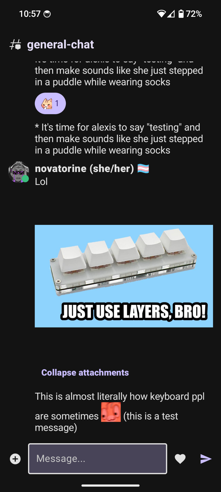
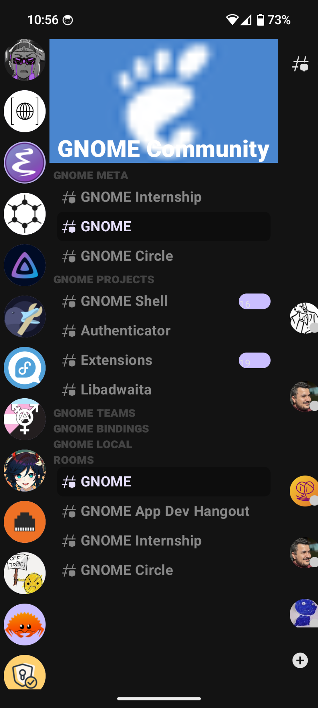
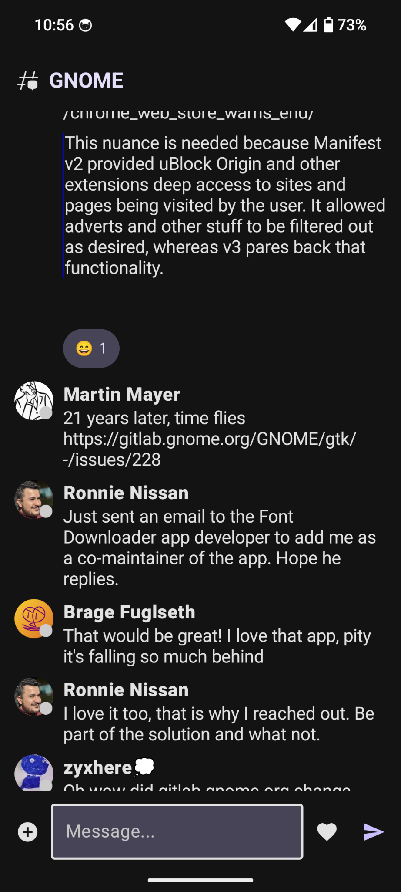

  
  <h1>Bloc</h1>
  
The Matrix client for Discord fugitives

  

---

  

Bloc is an Android-native client for the [Matrix](https://matrix.org/) decentralized chat protocol, designed for Discord fugitives.

## 🚧 Status: ALPHA QUALITY SOFTWARE 🚧

**Disclaimer:** This project is in early alpha. I'm trying to polish and bugfix and optimize as I go, so that each feature I complete is largely in its final form, but the overall application will be lacking features and polish up to my high standards for a very long time. Please judge with that in mind!

## Why do we need another Matrix client?

The mobile Matrix client space suffers from a critical hole in the market: while each of the existing options has their benefits and drawbacks, none offers the fast, feature-rich, efficient to navigate, and server/space-oriented (IRC-lite) model of Discord.

Element is well supported and covers the basic Matrix protocol well, but it is slow, inefficiently laid out (requiring more steps than necessary to switch servers/spaces and channels/rooms because the current room, the rooms in a space, and the spaces you are a member of are all completely separate screens, and it does not allow gestures to be used to navigate besides the unreliable OS-level "back" gesture), and doesn't support a lot of the [optional matrix protocols](https://github.com/Sorunome/matrix-doc/blob/soru/emotes/proposals/2545-emotes.md) that would make it appealing for those looking to switch from things like Discord.

SchildiChat is a barebones fork of an old version of Element that seems to want to want to pretend Matrix never developed past the point the fork was made, refusing to support even basic protocol additions like spaces in an attempt to retain the simple, iMessage-chat-like M.O. of old Matrix. Moreover it suffers from the same slowness as regular Element.

Then there's FluffyChat, Bloc's primary competitor. It is beautiful, uses Flutter to achieve better UI performance relative to Element, and it supports spaces at least. However it doesn't currently support image packs or other optional matrix protocol features that would make it attractive to Discord fugitives, and [doesn't seem interested in them as a core feature](https://github.com/krille-chan/fluffychat/issues/1243), rather forking that off to the SDK-level. Furthermore, for many UI features it seems to rely heavily on text commands, and the interface suffers from the same awkward, uncessarily inefficient layout as the other matrix clients.

Bloc aims to fill this gap with an efficiently designed, gesture navigation oriented, fully GUI, native-performance, Discord-like client.

It's standout features are:

## Features

- 🚀 **Built well.** Bloc is written using the latest tools for Android-native development, [Kotlin](https://kotlinlang.org/) and [Jetpack Compose](https://developer.android.com/jetpack/compose), allowing both for native performance and maximum utilization of your hardware thanks to Kotlin's powerful coroutine capabilities, but also maximum developer velocity and clean code. All of Bloc's code is written with a constant eye towards industry best practices and a conscious focus on code clarity, maintainability, and most especially performance.
- 🔍 **A clear, clean, consistent, and minimalist Material You-based design, familiar to anyone who liked Discord's old UI.** Free/Libre and Open Source Android applications don't have to be ugly, and Bloc is out to prove that. Following in FluffyChat's footsteps, Bloc aims to be an absolutely *beautiful* Material You compliant Matrix client. Moreover, as all good Material You applications should, Bloc completely pulls its color theme, including light/dark mode, from your system — instantly have a personalized app, with no need to customize it!
- ✨ **A gesture-first interface that makes you feel like you're in Minority Report.** Bloc's interface is built around gestures first and foremost, with every single one carefully tuned for momentum and repeatability, so that interacting with it feels like communicating with the app telepathically. Moreover, all spaces, user settings, rooms, and DMs are literally just a single swipe gesture (that does not dismiss your chat window, leaving it loaded there ready and waiting, and allowing you to peek at spaces/rooms without committing to leave a room) away at all times.
- 🔐 **A privacy and independence conscious design.** Not only does Bloc treat self-hosted Revolt servers as first-class citizens, it also treats users of deGoogled Android (such as those on LineageOS, DivestOS, CalyxOS, or GrapheneOS) and other privacy-conscious Android users as first-class citizens as well, by using a persistent foreground service to receive notifications instantaneously over WebSockets at a minor battery cost instead of receiving notifications through Google's Firebase Cloud Messaging Platform.[^1]

## Installation

Eventually Bloc will be released on F-Droid. For now, once there is a public Alpha available, you should be able to get it in the "releases" sidebar on GitHub.

## Roadmap

## Roadmap to the first alpha

- [X] Rooms
- [X] Sending messages
- [X] Rich text (viewing and sending)
- [X] Spaces
- [X] Custom image pack (custom emoji and stickers) (viewing)
- [X] Existing reaction support (viewing and adding to)
- [X] Reply, delete, and edit (viewing)
- [X] File and image attachment (viewing/downloading)
- [X] All attachment types (sending)
- [X] Attachment collapsing
- [X] Basic preferences (font size, attachment behavior, AMOLED theme)
- [X] Pulling color theme and dark/light mode from system
- [ ] Reply, delete, and edit (sending)
- [ ] Custom image pack (sending)
- [ ] Reaction support (initiating)
- [ ] Notification support using foreground service

## Roadmap to 1.0

- [ ] Threads
- [ ] Encrypted messages (sending and viewing)
- [ ] Encryption events (viewing)
- [ ] Blocking and reporting
- [ ] Joining new spaces/rooms by URL
- [ ] Space lobbies for discovering rooms
- [ ] Better support for DMs

## Acknowledgements

- In-app vectors and icons by <a href="https://www.figma.com/community/file/1166831539721848736?ref=svgrepo.com" target="_blank">Solar Icons</a> in CC Attribution License via <a href="https://www.svgrepo.com/" target="_blank">SVG Repo</a>
- <a href="https://www.flaticon.com/free-icons/bandana" title="bandana icons">Bandana icon created by Freepik - Flaticon</a>

[^1]: Firebase Cloud Messaging (FCM) is what most applications on Android use. With FCM, app developers must register the server they want to produce push notifications with Google's cloud infrastructure, and then put a manifest file in their application indicating they want to recieve notifications from that server. Then Google Play Services (a piece of closed-source data-hoovering spyware) takes the list of all the applications that want push notifications and all the servers they want them from, and listens to Google's central Firebase Cloud Messaging servers, which use the configuration the app developer created on Google's cloud platform to relay push notifications from the various sources they originate from to Google Play Services, which then distributes them to the relevant apps. This of course creates privacy and centralization/monopoly concerns, since it requires all apps that want push notifications to use Google Play Services (thus locking Android users into using a version of Android made by Google) and routes all notifications through Google's services. On the other hand, Bloc's architecture bypasses that at a very, very small battery cost (["consumes about 0-1% of battery in 17h of use"](https://docs.ntfy.sh/faq/?h=battery) according to the creators of the foreground service algorithm I use). Bloc's architecture also allows recieveing push notifications from arbitrary self-hosted Revolt servers with no further setup, whereas getting traditional FCM push notifications to work would require each owner of a self-hosted Revolt server to individually connect their server to the FCM servers and then release a custom build of the app.
